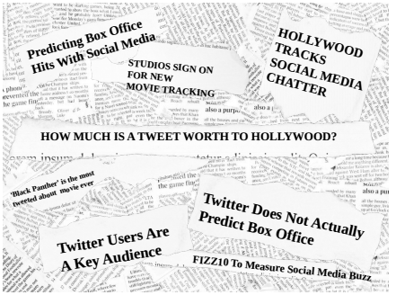
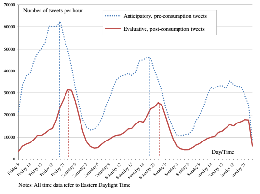
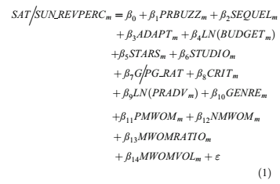
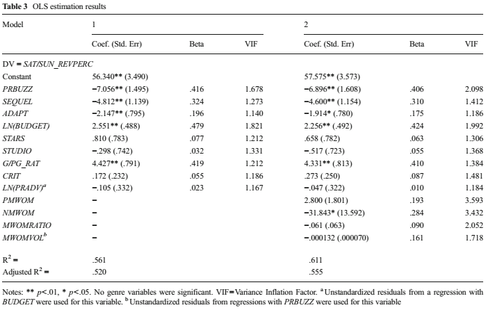

class: font200

# Learning Goals for this Week

TBD

---
class: inverse, center, middle

# Why Word of Mouth Matters

---
# What is Word of Mouth Marketing?

Consumer's interest in a company's product or service is reflected in their "daily dialogues"

* Why is this *new* in "social media"?
  * It isn't a new idea ...
  * The "social web" with it's increasing connectivity makes it more salient
  * ... and measurable

---
# Types of Word of Mouth 

**Organic word of mouth**:

* People become advocates for a product and have a desire to share their views.
* **This is our focus this week**

**Amplified word of mouth**: 

* Marketers launch campaigns designed to encourage or accelerate WoM in existing or new communities.
* We'll come back to this later in the course -- "Social Advertising"

**Online versus Offline**

* Distinction is always lurking in the background

---
# Social Media Word of Mouth Matters

* Consumers now spend more than 135 mins per day on social media
    - Social media sites contain a treasure-trove of decision relevant information
    - Twitter is the main platform for opinion exchange

* Social Media fostered growing importance of WoM marketing

* Chief Marketing Officers think online WoM matters
    - ... Rationalized by consumer's trust in online info from peers (Nielsen, 2013)
    - 64% of marketing executives believe word of mouth is the most effective form of marketing
    - Only 6% say they have mastered it.

---
# Why Social Media Might Matter:

Three mechanisms at play:

1. Awareness
2. Buzz
3. Social learning

Most often we see:

* Awareness & Buzz $\rightarrow$ volume of tweets
* Social learning $\rightarrow$ sentiment in tweet's text
  * Sentiment often called valence

---
# Tweet Volume Measures Awareness and Buzz

* Awareness
    * Introduces new consumers to a movie
    * Reminds consumers about movie
    * Reinforce traditional advertising
* Buzz: expressions of anticipation
    * Increase in anticipation $\rightarrow$ increase in volume of posts
        * By consumers who want to act as opinion leaders, and reflect their interests, excitement, and expectations
        * Generally "neutral" in sentiment

---
# Sentiment Measures Movie Quality

* Sentiment expressed tweet's text provides means to measure quality
* Tweet Sentiment impacts sales via social learning
    * Quality revealed through interactions with their peers
    * Relevant if consumer's use these reviews to decide what movie to attend

* Important to control for other ways consumers learn about movie quality

---
# Why Should We Care?

- Social media can generate awareness, buzz and information diffusion that ultimately influences demand
- Important when:
    1. Relying on "hyped release strategies"
    2. Uncertainty about a product's quality
- Examples: movies, books, consumer electronics, video games, fashion

.center[**Most relevant for new products early in release**]

---
# Today's Agenda 

.center[**The effect of Social Media WoM on demand**]

Two papers:

* [Does Twitter matter? The impact of microblogging word of mouth on consumers' adoption of new movies][tht]
  * Hennig-Thurau, Wiertz and Feldhaus (2015, JAMS)
* [Does Online Word-of-Mouth Increase Demand? (and How?) Evidence from a Natural Experiment][seiler]
  * Seiler, Yao and Wang (2017, Marketing Science)

[seiler]: https://pubsonline.informs.org/doi/abs/10.1287/mksc.2017.1045
[tht]: https://link.springer.com/article/10.1007/s11747-014-0388-3 

---
class: inverse, center, middle

# Does Twitter matter? The impact of microblogging word of mouth on consumers' adoption of new movies

---
# Twitter & Movies

```{r, echo = FALSE, fig.align = "center", out.width="90%"}

```

---
# Searching for a "Twitter Effect"

**Motivation**: (Twitter) WoM and early product adoption

**Specific Questions**:

* Does Twitter WoM impact demand? (early adoption behaviour)
* Are there different effects for positive and negative Twitter comments?

**Industry**: US Movies, theatrical release

* A "favourite" for WoM research
* Buzz, awareness, uncertain quality all play a role

---
# Empirical Approach 


**Data**:

* Box Office earnings over opening weekend - Oct 2009 to Oct 2010
* Twitter posts in opening 24 hours, want volume *and* sentiment
* Info about movie characteristics (as control variables)
  * Including critic reviews *and* pre-release ad spending

**Empirical Approach**:

* Classify reviews as positive/negative/neutral
  * "Text-as-data" + machine learning
* Estimate a regression of "demand" on Twitter 

---
# How Tweets Evolve

```{r, echo = FALSE, fig.align = "center", out.width="80%"}

```
---
# Regression Framework

```{r, echo = FALSE, fig.align = "center", out.width="65%"}

```

---
# Results

```{r, echo = FALSE, fig.align = "center", out.width="120%"}

```

---
# Mechanism

.center[**Why is there "Twitter Effects"?**]

* Survey Twitter users to find out..

**Findings**:

* Twitter users are movie go-ers
* Negative tweets stand out to them
  * Honest, different from positive marketing spin
* Twitter as a means to find information:
  1. First resort for movie information
  2. Tool to sway opinion
  3. As a fallback 
  4. Recommendations from friends

---
class: inverse, center, middle

# Does Online Word-of-Mouth Increase Demand? (and How?) Evidence from a Natural Experiment

---
# License & Citation

Suggested Citation:

```{r, engine='out', eval = FALSE}
@misc{smwa_2021_l4,
      title={"Social Media and Web Analytics: Lecture 4 - Word of Mouth"},
      author={Lachlan Deer},
      year={2021},
      url = "https://github.com/tisem-digital-marketing/smwa-lecture-04"
}
```

<p style="text-align:center;"></p>

This course adheres to the principles of the Open Science Community of Tilburg University. 
This initiative advocates for transparency and accessibility in research and teaching to all levels of society and thus creating more accountability and impact.

<p style="text-align:center;"></p>
This work is licensed under a <a rel="license" href="http://creativecommons.org/licenses/by-sa/4.0/">Creative Commons Attribution-ShareAlike 4.0 International License</a>.