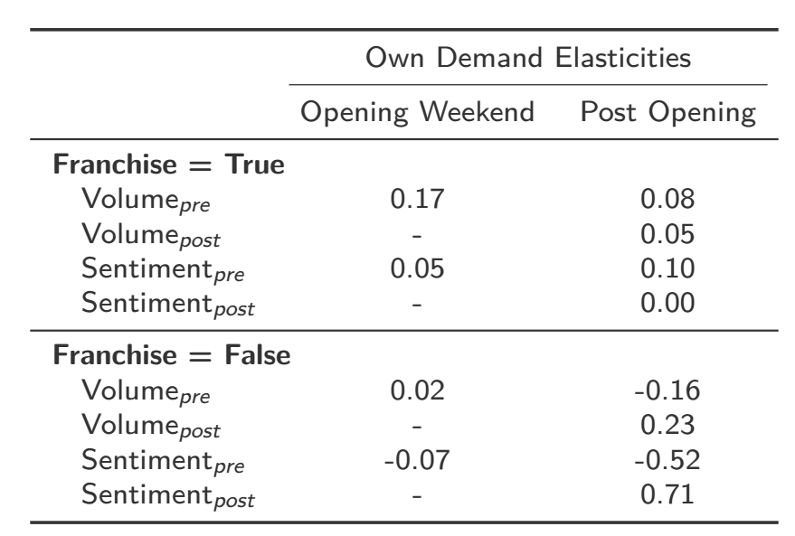

class: font200

# Learning Goals for this Week

TBD

---
class: inverse, center, middle

# Why Word of Mouth Matters

---
# What is Word of Mouth Marketing?

Consumer's interest in a company's product or service is reflected in their "daily dialogues"

* Why is this *new* in "social media"?
  * It isn't a new idea ...
  * The "social web" with it's increasing connectivity makes it more salient
  * ... and measurable

---
# Types of Word of Mouth 

**Organic word of mouth**:

* People become advocates for a product and have a desire to share their views.
* **This is our focus this week**

**Amplified word of mouth**: 

* Marketers launch campaigns designed to encourage or accelerate WoM in existing or new communities.
* We'll come back to this later in the course -- "Social Advertising"

**Online versus Offline**

* Distinction is always lurking in the background

---
# Social Media Word of Mouth Matters

* Consumers now spend more than 135 mins per day on social media
    - Social media sites contain a treasure-trove of decision relevant information
    - Twitter is the main platform for opinion exchange

* Social Media fostered growing importance of WoM marketing

* Chief Marketing Officers think online WoM matters
    - ... Rationalized by consumer's trust in online info from peers (Nielsen, 2013)
    - 64% of marketing executives believe word of mouth is the most effective form of marketing
    - Only 6% say they have mastered it.

---
# Why Social Media Might Matter:

Three mechanisms at play:

1. Awareness
2. Buzz
3. Social learning

Most often we see:

* Awareness & Buzz $\rightarrow$ volume of tweets
* Social learning $\rightarrow$ sentiment in tweet's text
  * Sentiment often called valence

---
# Tweet Volume Measures Awareness and Buzz

* Awareness
    * Introduces new consumers to a movie
    * Reminds consumers about movie
    * Reinforce traditional advertising
* Buzz: expressions of anticipation
    * Increase in anticipation $\rightarrow$ increase in volume of posts
        * By consumers who want to act as opinion leaders, and reflect their interests, excitement, and expectations
        * Generally "neutral" in sentiment

---
# Sentiment Measures Movie Quality

* Sentiment expressed tweet's text provides means to measure quality
* Tweet Sentiment impacts sales via social learning
    * Quality revealed through interactions with their peers
    * Relevant if consumer's use these reviews to decide what movie to attend

* Important to control for other ways consumers learn about movie quality

---
# Why Should We Care?

- Social media can generate awareness, buzz and information diffusion that ultimately influences demand
- Important when:
    1. Relying on "hyped release strategies"
    2. Uncertainty about a product's quality
- Examples: movies, books, consumer electronics, video games, fashion

.center[**Most relevant for new products early in release**]

---
# Today's Agenda 

.center[**The effect of Social Media WoM on demand**]

Two papers:

* [Online Word of Mouth and the Performance of New Products][deer]
  * Deer, Chintagunta and Crawford (2019, Working Paper)
* [Does Online Word-of-Mouth Increase Demand? (and How?) Evidence from a Natural Experiment][seiler]
  * Seiler, Yao and Wang (2017, Marketing Science)

[seiler]: https://pubsonline.informs.org/doi/abs/10.1287/mksc.2017.1045
[deer]: https://lachlandeer.github.io/media/deer_jmp.pdf

---
class: inverse, center, middle

# Online Word of Mouth and the Performance of New Products

---
# Twitter & Movies

```{r, echo = FALSE, fig.align = "center", out.width="90%"}

```

---
# What This Paper is About

.center[**Quantifying the impact of online WoM on new product performance**]

* Estimate demand elasticities w.r.t.:
    1. Volume of Tweets $\rightarrow$ Awareness & Buzz
    2. Tweet Sentiment $\rightarrow$ Information diffusion

* How:
    - Structural model of consumer demand
    - ... Control for endogenous advertising and offline WoM

* Application:
    - Movie Industry
    - Twitter

---
# Twitter & the Movie Industry

- Twitter is main online platform for movies (Twitter, 2014)
    - Sixth most discussed topic on Twitter (Hu et al, 2017)
    - $\approx 200,000$ tweets per day (Suslak, 2014)

* Nielsen surveys (2014/15) find Twitter users:
    - 340% more likely than non-users to have seen more than 12 movies over the last six months
    - Nearly twice as likely to see a film within 10 days of its opening
    - 87% of Twitter users recent movie attendance was influenced by tweets
    - 63% heard about movies through social media
    - Over half of movie-going Twitter users share their thoughts on Twitter after they leave the theater.

---
# Data Sources

US Movie Industry 2014 & 2015:

* Wide release movies - opened to at least 600 cinemas
* Released on a Friday
* 222 movies out of approx. 300 wide releases

Industry Data on:

1. Box Office & movie characteristics
2. Critic reviews
3. Consumer Reviews
4. Advertising Data
5. Ex-ante Box Office Predictions

---
# Data Sources: Twitter

Individual tweets about each movie from Twitter’s Historical Powertrack

* Search for tweets about each movie using
    1. Movie name
    2. Relevant hashtags
    3. Movie franchise + Sequel indicators
* Baseline data: $\pm 6$ months from release date
    * Restrict to  60 days pre-release until end of the third weekend
    * 48 million movie relevant tweets
        - approx 300K per movie

---
# From Tweet Content to Tweet Sentiment

* VADER Sentiment Lexicon (Hutto & Gilbert 2014)

* Sentiment Lexicon:
    - Word list with semantic orientation: positive or negative
    - Strength of sentiment expressed

* VADER extends 'standard' lexicons for online language:
    1. Punctuation - exclamation marks strengthen sentiment
    2. Capitalization - all caps strengthens sentiment
    3. Emoticons

* Correlates well with human encoders across multiple domains, $corr > 0.88$
* Outperforms standard ML approaches (Riberio et al, 2016)

---
# Classifying Tweets with VADER

* VADER gives a score for each tweet $score \in [{-1}, 1]$
* We bin tweets into three categories:
    * Positive Tweet: $score \in [0.05, 1]$
    * Neutral Tweet: $score \in [{-0.05}, 0.05]$
    * Negative Tweet: $score \in [{-1}, -0.05]$

* **Main Output**:
    - number of tweets per category for each movie-day pair
    - Sentiment: positive-negative ratio

---
# Structural Model of Movie Demand

* Sliding Window Nested Logit Demand
    * Explicit assumptions about consumer preferences and decision making
    * 'Sliding Window' - frequent rotation of movies in and out of cinemas
    * Aggregate individual decisions to national market shares for estimation

* Notation:
    * $i = 1, 2, 3, \ldots, M$ individuals
    * $t = 1, 2, 3, \ldots, T$ days
    * $j = 1, 2, 3, \ldots, J$ movies
        * $J_t$ is the set of movies that are currently in cinemas

---
# Utility Specification - Movies

$$
\begin{aligned}
u_{ijt} = x_{jt} \beta_{t - r_j} \, + \,
w_j^{(1)} \gamma \, + \,
w_j^{(2)}\lambda_{t - r_j} \, + \,
\sum_{s=1}^\mathcal{S} d_{js} \theta_{s} \, + \,
\xi_{jt} \, + \,
\bar{\varepsilon}_{ijt}
\end{aligned}
$$

---
# Utility Specification - Movies

$$
\begin{aligned}
u_{ijt} = x_{jt} \beta_{t - r_j} \, + \,
w_j^{(1)} \gamma \, + \,
w_j^{(2)}\lambda_{t - r_j} \, + \,
\sum_{s=1}^\mathcal{S} d_{js} \theta_{s} \, + \,
\xi_{jt} \, + \,
\bar{\varepsilon}_{ijt}
\end{aligned}
$$

* Time-Varying Characteristics, $x_{jt}$
    * Pre- & Post-release measures of:
        * Twitter Volume
        * Twitter Sentiment
        * Advertising Expenditure
* Time-Varying Parameters, $\beta_{t-r_j}$:

$$
\begin{aligned}
\beta_{t - r_j} = \beta_{\textrm{open}} 1 \left\lbrace 0 \leq  t - r_j < 3 \right\rbrace +
    \beta_{\textrm{post}} 1 \left\lbrace t - r_j \geq 3 \right\rbrace
\end{aligned}
$$

---
# Utility Specification - Movies

$$
\begin{aligned}
u_{ijt} = x_{jt} \beta_{t - r_j} \, + \,
w_j^{(1)} \gamma \, + \,
w_j^{(2)}\lambda_{t - r_j} \, + \,
\sum_{s=1}^\mathcal{S} d_{js} \theta_{s} \, + \,
\xi_{jt} \, + \,
\bar{\varepsilon}_{ijt}
\end{aligned}
$$


---
# Utility Specification - Movies

$$
\begin{aligned}
u_{ijt} = x_{jt} \beta_{t - r_j} \, + \,
w_j^{(1)} \gamma \, + \,
w_j^{(2)}\lambda_{t - r_j} \, + \,
\sum_{s=1}^\mathcal{S} d_{js} \theta_{s} \, + \,
\xi_{jt} \, + \,
\bar{\varepsilon}_{ijt}
\end{aligned}
$$

* Time-Invariant Characteristics w/ Constant Preference, $w_j^{(1)}$
    * Actor Starpower
    * 2nd degree polynomials in critic review and production budget
    * **CinemaScore grades**
        * Correlated with offline WoM
        * Tries to soak up WoM from external sources}


---
# Utility Specification - Movies

$$
\begin{aligned}
u_{ijt} = x_{jt} \beta_{t - r_j} \, + \,
w_j^{(1)} \gamma \, + \,
w_j^{(2)}\lambda_{t - r_j} \, + \,
\sum_{s=1}^\mathcal{S} d_{js} \theta_{s} \, + \,
\xi_{jt} \, + \,
\bar{\varepsilon}_{ijt}
\end{aligned}
$$

Modelling Market Share Decay, $w_j^{(2)}$

$$
\begin{aligned}
w_j^{(2)} \lambda_{t - r_j} = \lambda^{(1)}_{t - r_j} 1 \left\lbrace \textrm{Is Franchise} \right\rbrace +
    \lambda^{(2)}_{t - r_j} 1 \left\lbrace j \textrm{ in genre } g \right\rbrace
\end{aligned}
$$

* Franchise FE:
  * Higher general awareness and offline WoM
  * Different demand patterns
  * More controls to to soak up WoM from external sources
* Genre FE:
  * Flexibly fit market share decay patterns
  * Variation within genre-day combinations identifying $x_{jt}$

---
# Utility Specification - Movies

$$
\begin{aligned}
u_{ijt} = x_{jt} \beta_{t - r_j} \, + \,
w_j^{(1)} \gamma \, + \,
w_j^{(2)}\lambda_{t - r_j} \, + \,
\sum_{s=1}^\mathcal{S} d_{js} \theta_{s} \, + \,
\xi_{jt} \, + \,
\bar{\varepsilon}_{ijt}
\end{aligned}
$$

Expected Performance Tier Fixed Effects, $\theta_s$
  * ... pre-release prediction from Hollywood Stock Exchange
  * We split expected box office in six tiers ...
  * ... Each tier has different levels of consumer buzz and awareness driven by offline WoM
  * Third set of controls to absorb offline WoM
  * Control for endogenous ad spending
    - high expected performance $\rightarrow$ large ad spend

---
# Utility Specification - Movies

$$
\begin{aligned}
u_{ijt} = x_{jt} \beta_{t - r_j} \, + \,
w_j^{(1)} \gamma \, + \,
w_j^{(2)}\lambda_{t - r_j} \, + \,
\sum_{s=1}^\mathcal{S} d_{js} \theta_{s} \, + \,
\xi_{jt} \, + \,
\bar{\varepsilon}_{ijt}
\end{aligned}
$$

* Scalar Unobserved Characteristic, $\xi_{jt}$
    * Observed by consumers and movie studios, not to us as researchers
* Individual specific valuations, $\bar{\varepsilon}_{ijt}$:
  * Correlated within genre

---
# Utility Specification - Outside Good

$$
\begin{aligned}
u_{i0t} = - \tau_{t} \, +  \, \bar{\varepsilon}_{i0t}
\end{aligned}
$$

* Seasonality in demand, $\tau_t$

$$
\begin{aligned}
\tau_t = \sum_{c=1}^{52} &\kappa_c 1 \left\lbrace t \textrm{ in calendar week } c \right\rbrace \\ +
    &\sum_{d \in \left\lbrace \textrm{Fri, Sat, Sun} \right\rbrace } \omega^{(d)}
    1 \left\lbrace t \textrm{ on day } d \wedge
                            t \textrm{ is Public Hol. Wkend} \right\rbrace
\end{aligned}
$$ 

---
# Main Result - Demand Elasticities

```{r, echo = FALSE, fig.align = "center", out.width="120%"}
knitr::include_graphics("figs/deer_main.png")
```

---
# Franchise Heterogeneity

```{r, echo = FALSE, fig.align = "center", out.width="90%"}

```

---
# Expected Performance Heterogeneity

```{r, echo = FALSE, fig.align = "center", out.width="75%"}

```

---
# Takeways

Awareness, buzz and information diffusion channels from online WoM are important determinants of demand

On average, we find:

* Pre-release volume elasticity of 0.04
* Post-release volume elasticity of 0.08
* Post-release sentiment elasticity of 0.27

**Effects are small compared to existing literature**

---
# Takeways II

Important heterogeneity across movie characterstics:

* Franchise Movies:
    * Pre-release volume elasticity of 0.17 $\rightarrow$ Buzz
    * Largest for blockbusters, elasticity of 0.34
* Non-Franchise:
    * Small movies $\rightarrow$ information diffusion
        * Post-release sentument elasticity of 0.7
    * Medium tier $\rightarrow$ growing awareness
        * Post-release volume Elasticity of 0.23

* Managerial Implication: Different type of products have different channels thru which WoM matters

---
class: inverse, center, middle

# Does Online Word-of-Mouth Increase Demand? (and How?) Evidence from a Natural Experiment

---
# Online WoM Redux

**Motivation**: Causal inference is particularly difficult in the realm of online WOM due to the fact that
firms are not directly in control of the amount of WOM.

**Specific Questions**:

* What is the demand elasticity of demand wrt volume of posts?
* What is the mechanism through which online WoM influences choice?

**How?**: Natural experiment -- shutdown if Sina Weibo due to political events in mainland China but not HK

* Sina Weibo $\approx$ Chinese Twitter

---
# Empirical Approach

**Industry**: TV show viewership -- soapies

* Not really **new** products

**Data**:

* TV ratings (i.e. viewership) at episode/city level in mainland China and HK
* Microblogging activity about each show

**The Natural Experiment**: Censorship block on Sina Weibo

* Large, random shock, unrelated to TV
* Block in mainland China, **but not** HK

---
# Difference in Differences

$$
LogRating_{jt} = \alpha Block_{t} \beta Block_{t} + Mainland_{j} + \delta_j + Weekday_t' \gamma + \varepsilon_{jt}
$$

For causality ...

* Valid Counterfactual: HK approximates China
* No Selection on Unobservables: Nothing unobserved driving treatment

---
# Graphical Evidence I

```{r, echo = FALSE, fig.align = "center", out.width="110%"}

```

---
# Graphical Evidence II

```{r, echo = FALSE, fig.align = "center", out.width="110%"}
knitr::include_graphics("figs/seiler_ratings.png")
```

---
# Diff in Diff Results

```{r, echo = FALSE, fig.align = "center", out.width="75%"}

```

---
# What is the Mechanism?

```{r, echo = FALSE, fig.align = "center", out.width="50%"}
knitr::include_graphics("figs/seiler_mechanism.png")
```

--- 
# Takeaways

* Estimated Volume elasticity: between 0.016 and 0.026

* WoM influnces demand via consumption complementarities 
  * Can chat about it later online

* Managerial Implications:
  * Fostering post-show discussion
  * Doesn't appear to be valence effects 
    * (maybe because quality is known?)

---
# License & Citation

Suggested Citation:

```{r, engine='out', eval = FALSE}
@misc{smwa_2021_l4,
      title={"Social Media and Web Analytics: Lecture 4 - Word of Mouth"},
      author={Lachlan Deer},
      year={2021},
      url = "https://github.com/tisem-digital-marketing/smwa-lecture-04"
}
```

<p style="text-align:center;"></p>

This course adheres to the principles of the Open Science Community of Tilburg University. 
This initiative advocates for transparency and accessibility in research and teaching to all levels of society and thus creating more accountability and impact.

<p style="text-align:center;"></p>
This work is licensed under a <a rel="license" href="http://creativecommons.org/licenses/by-sa/4.0/">Creative Commons Attribution-ShareAlike 4.0 International License</a>.